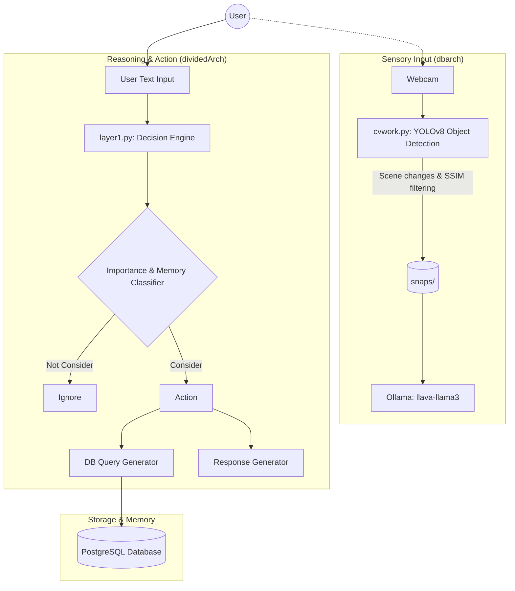

# Divya AI Project Analysis

> [!NOTE]
> This analysis report breaks down the total architecture and functionality of your `projectD` repository. The project appears to be a multimodal conversational AI assistant named "Divya", equipped with long/short-term memory, custom routing for complex decision-making, and structural computer vision capabilities.

## Architecture Highlights

The project consists of three main systems, which have currently been separated into distinct modules:

1. **Conversational core & Memory (Core)**
2. **Advanced Decision Engine (dividedArch)**
3. **Computer Vision & Hardware Senses (dbarch)**

---

## 1. Core Component (`core/`, `main.py`)
This serves as the foundational skeleton of the conversational flow. 
- **`main.py`**: Initializes the memory pipelines (`ShortTermMemory`, `LongTermMemory`) and a `DialogueManager`.
- It currently hosts a simple command-line loop enabling continuous dialogue under the alias `Divya`.

> [!TIP]
> The `main.py` file represents an earlier or abstracted iteration of the pipeline since the more advanced classification mechanics seem to reside heavily in `dividedArch/layer1.py`.

## 2. Advanced Decision Engine (`dividedArch/`)
This module brings deep agentic capabilities, specifically tailored towards maintaining the identity and conversational state.
- **`layer1.py`**: A complex routing layer that queries an external LLM proxy (`https://myai.ganiisunkara.workers.dev`) using strict rules. It evaluates the user's input and returns JSON dictating whether it's contextually meaningful (`"CONSIDER"`/`"NOT_CONSIDER"`), the duration of relevance (`"TEMPORARY"`, `"SHORT_TERM"`, `"LONG_TERM"`), and whether database insertion or retrieval (`"DB_QUERY"`) is required.
- **Prompt Engineering**: Found in `instruction.txt`, the prompt explicitly maps out a hierarchical database structure mapping conversational contexts into specific topics like `"Relationships"->"Romantic"->"Partner"`. 
- **`personality.txt`**: Used to condition the model's generated responses so it maintains character as "Divya".

## 3. Computer Vision & Scene Understanding (`dbarch/`)
This brings multimodality (eyes) to the Divya AI.
- **`cvwork.py`**: Uses OpenCV and the **YOLOv8** (`yolov8n.pt`) model for real-time webcam object detection. It is heavily optimized through a Smart Snapshot System that only saves an image to the `snaps/` folder if a *new* object is detected or large scene modification happens. It utilizes `SSIM` (Structural Similarity Index) to prevent duplicate snaps.
- **`main.py` (Inside `dbarch`)**: Acts as a bridge between computer vision and the LLM. It fetches an image block and queries a local `ollama` instance running the `llava-llama3:8b` multimodal model to generate brief scene descriptions.
- **`dbconnect.py`**: Facilitates robust communication with a local PostgreSQL server (`localhost:5432`, user: `postgres`). Defaults to read-only queries as a safety fail-safe mechanism but allows mutations when explicitly requested by upstream functions. 

---

## Key Observations and Future Directions

> [!IMPORTANT]  
> The project currently feels modular—while impressive components exist independently, there are opportunities to heavily unify them into a single loop.

- **Unification:** `dividedArch/layer1.py`, `core/main.py`, and `dbarch/main.py` act somewhat independently. The layer 1 decision engine handles conversational LLM routing, while `ollama` is reserved strictly for interpreting localized webcam frames. Wiring `ollama`'s spatial output into the broader chat history state in `layer1` will dramatically elevate Divya's contextual awareness.
- **Error Handling:** When `layer1.py` prompts the LLM API and it returns misformatted JSON, it falls back onto strict rules but could eventually break the `.get` logic in the parser. Wrapping this in robust fallback handlers/retries can make it fault-tolerant.
- **External Dependencies:** The reliance on `https://myai.ganiisunkara.workers.dev` for `layer1.py` might become a latency bottleneck. With local tools like Ollama already running the heavy LLaVA model via `dbarch`, you could potentially run the Decision Engine routing prompts completely locally for maximum privacy and snappiness.
